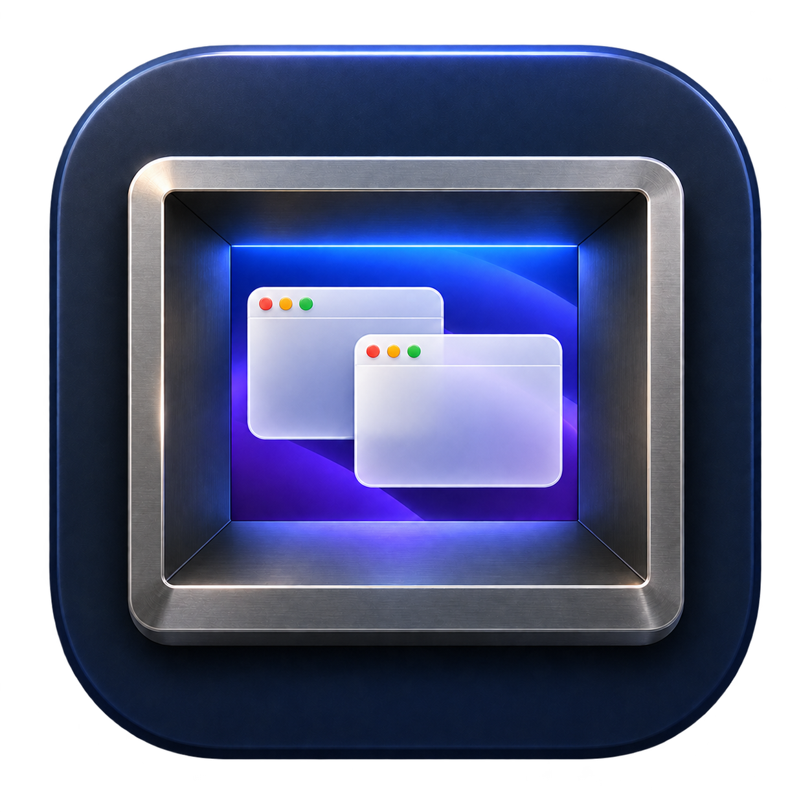

# Diorama

**A desktop in a box.**

Diorama creates a second, invisible display on your Mac and shows it live inside a window on your real screen. Put the tools you are working on in there, arrange them once, and they stay exactly as you left them: your own desktop stays clean, the picture is always ready for a screenshot of a complete desktop, and when you move the pointer into the picture you are working inside it for real.

<p align="center"></p>

## How it works

The box is a real display as far as macOS is concerned — it has its own wallpaper, menu bar, Spaces and resolution — but it has no physical screen behind it. Diorama captures it with ScreenCaptureKit and paints the frames into the stage window.

Once both permissions are granted, Diorama fences the pointer off that display, so the edge of your real screen stays a hard edge. There are two deliberate ways in:

- **Move the pointer into the picture.** While it is inside, it lives on the virtual display: clicks, drags, scrolling and typing all go to the windows in the box, and the picture follows your hand one to one. Move out of the picture, or push against its edge, and the pointer pops back out beside it.
- **Send a window.** Press ⌃⌥⌘D in any application to move its front window into Diorama, ⌃⌥⌘B to bring it back, and ⌃⌥⌘R to return everything. The toolbar and **Stage** menu use the last active application when Diorama itself is frontmost.

Switch **Stage › Interactive** off (⌃⌥⌘I) for a view-only stage. Closing the stage window quits Diorama and removes the virtual display; macOS returns its windows to a remaining display. Capture failures release the pointer and show an error with **Try Again**; Diorama also retries after five seconds.

A plain left-click on empty wallpaper inside the stage is ignored, preventing macOS's **Click wallpaper to reveal desktop** action from sweeping windows away on every display. App windows, menus, the Dock, and desktop context clicks remain interactive. The virtual display shares your macOS login session; Diorama does not change your global desktop settings.

## Screenshots

The camera button or ⌃⌥⌘S saves a full-resolution PNG of the whole virtual desktop — wallpaper, menu bar and windows, no cursor — to `~/Pictures/Diorama`, then opens it in **Preview** for copying, cropping, or annotation. Repeated captures within the same second get a numeric suffix, preserving every image. If Preview cannot open, Diorama reveals the saved file in Finder. **Stage › Copy Screenshot** (⇧⌘C) puts a fresh capture directly on the clipboard. Because the box never changes unless you change it, every screenshot shows the same tidy, complete desktop without rearranging anything on your real screen.

The display offers Retina resolutions from 1024 × 576 to 1920 × 1080 points (2048 × 1152 to 3840 × 2160 pixels) under **Stage › Resolution**. Pick the one that matches the screenshots you want; 1920 × 1080 is the default.

## Requirements and build

macOS 15 or newer, with Xcode Command Line Tools supporting Swift 6. There are no third-party dependencies.

Choose an installed code-signing certificate once for this checkout. Copy its SHA-1 identifier from the first command into the second:

```sh
security find-identity -v -p codesigning
git config --local diorama.signingIdentity CERTIFICATE_SHA1
```

An Apple Development certificate works for local builds. The selection stays in local Git configuration; the certificate and private key stay in Keychain.

```sh
make test
make build
make install
open /Applications/Diorama.app
```

`make build` creates an optimized release at `dist/Diorama.app`, signed with the configured certificate and hardened runtime. Missing or unavailable identities fail the build instead of silently switching signers. `DIORAMA_SIGNING_IDENTITY` explicitly overrides the local selection, and `DIORAMA_BUILD_CONFIGURATION=debug` selects a development build. CI explicitly uses `DIORAMA_SIGNING_IDENTITY=-` for disposable ad-hoc artifacts; installing those over a certificate-signed local build changes its identity and can require permissions again.

`make run` builds and opens the repository's bundle; `make icon` regenerates `Support/Diorama.icns` from `Support/AppIcon.png`. Set `DIORAMA_INSTALL_DIR="$HOME/Applications"` for a user-local installation. The installer verifies a staged copy before replacing an older bundle, refuses to overwrite an unrelated app or symbolic link, and asks you to quit a running Diorama first. `make verify` checks the built bundle, entitlements, icon, executable boundaries, and runtime library paths.

On first launch the setup screen explains two permissions. Use its **Allow…** buttons to open the corresponding macOS settings:

- **Screen & System Audio Recording** — to capture the virtual display. macOS applies this after the app is relaunched.
- **Accessibility** — to fence the pointer, route it into the box and move other applications' windows.

The virtual display starts only after both permissions are available. Revoking access releases the pointer and removes the display. Switching from an older ad-hoc build to the certificate-signed build requires granting permissions once more. Subsequent builds keep a stable designated requirement tied to the certificate and bundle identifier. Keep using the same app location. If Settings shows an obsolete grant as allowed, quit Diorama, remove that entry, add the current app bundle, and reopen it.

## Access boundary

Diorama runs outside Apple App Sandbox: it installs a system-wide event tap, moves other applications' windows through the Accessibility API and creates a display using CoreGraphics interfaces that are not part of the public SDK. The `CGVirtualDisplay` classes are declared in `Sources/CGVirtualDisplayShim` and resolved from CoreGraphics at link time; they are the same interfaces used by virtual display utilities such as DeskPad and BetterDisplay, and they may change in a future macOS release.

This preserves the original project’s access boundary. No sandbox exceptions or additional entitlements are added by the alignment review. The event tap rewrites pointer locations, suppresses primary wallpaper gestures inside the stage, and consumes its own five hotkeys; it does not log or forward keystrokes. Screenshots stay on your Mac. No network access is used.

## Repository layout

```text
Sources/Diorama/                  Stage window, virtual display, capture, pointer bridge, window moving
Sources/DioramaCore/              Stage geometry, pointer fence, hotkeys, resolutions (pure, tested)
Sources/CGVirtualDisplayShim/     Declarations for the private CoreGraphics virtual display classes
Tests/DioramaCoreTests/           Behavioural tests for the core
Tests/DioramaTests/               Capture lifecycle and screenshot file regression tests
Support/Info.plist                Application metadata
Support/AppIcon.png               Icon master
Support/Diorama.icns              Multi-resolution application icon
scripts/                          Build, test, install, icon and signature verification
docs/architecture.md              How the pieces fit and what remains to verify
docs/review.md                    Alignment review and validation record
docs/icon.md                      Icon references and generation prompt
.github/workflows/ci.yml          macOS validation and app artifact
```

## Development checks

Run `make test` for the geometry, pointer fence, capture lifecycle, and screenshot regressions. The capture tests use an injected session to exercise failure and cancellation without recording the screen. The [review record](docs/review.md) distinguishes automated checks from the permission-dependent interaction checks that still need a hands-on pass.
